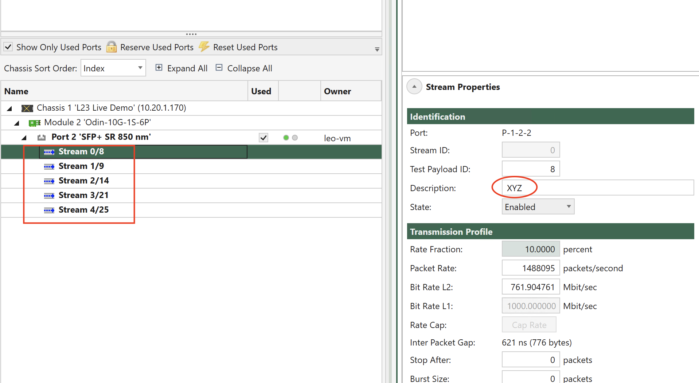

# XOA Script Documentation - Synchronize Created Streams to Script

This script will help you access the streams that are created on the port already.

Streams, once created on a port, will stay on the port until you explicitly remove them or reset the port. Using XOA Python API, you can write your own code to "synchronize" your Python code to the server status so your Python script can also access those streams on the port.

For instance, you already have streams on a port as shown below.



The script will show:
```
Connect to chassis: 10.20.1.170
Username:           10.20.1.170
Number of streams on the port: 5
Stream [0] : XYZ
Stream [1] : Stream number 1
Stream [2] : Stream number 2
Stream [3] : Stream number 3
Stream [4] : Stream number 4
```