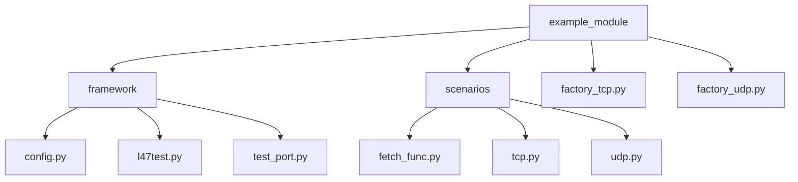

# Description
Usage of xoa_driver can be processed in 2 ways, via `High-Level interface` where we have wrapping of identifiers management and commands alignment, auto session handling, etc. `Low-Level interface` where users can have access to raw commands but at the same time need to take care of mapping and validation of possibility of usage of those commands under different equipment type, as well as periodically sending the keep-alive message.

Examples are placed in:
1) Example of High-Level interface - is placed at `./high_level_interface`
2) Example of Low-Level interface - is placed at `./low_level_interface`
3) Original script of CLI based library - is placed at `./original`

`xoa_driver` - examples are covering TCP and UDP TestCases provided by example but from `original` was modified only `tcptest.py` for being used with python3, in addition in original code was found 2 operational bugs:
1) Not properly stopping port traffic, for stop port traffic need to change state at first to STOPPED, after to OFF
2) Not closing the connection after the test was done which is not allowing to run another test case under the same script but on different socket connections with the same owner name.

## Script
`HLI - (High-Level interface)` and `LLI - (Low-Level interface)` - are using the same program structure, for simplifying comparison. 

`framework` - General resources management which is the same for all TestCases.

`scenarios` - Implementation of different TestCases.

`factory_<name>` - the factory of different TestCases.

> Based on this example can be the extended implementation of TestCase by using a `builder` which will allow composing multiple test scenarios as one big TestCase.


# Running
To run script please install xoa_driver first: 
```shell 
> pip install xoa-driver
```
If you already have environment variables defined please remove `.env` file, or modify it for your needs.
