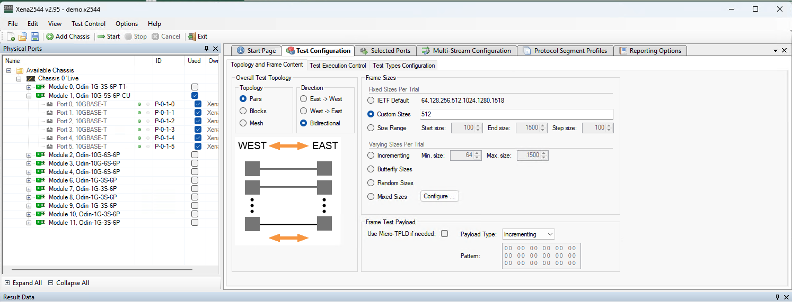
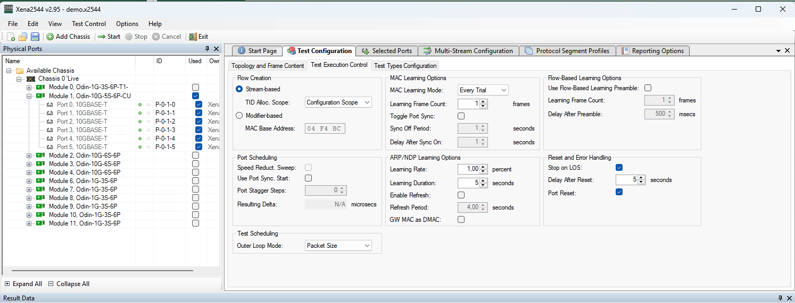
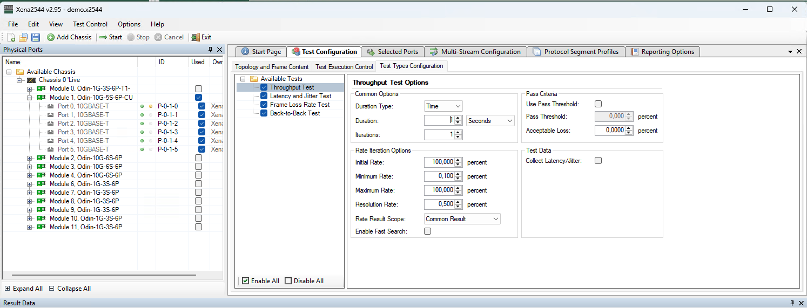
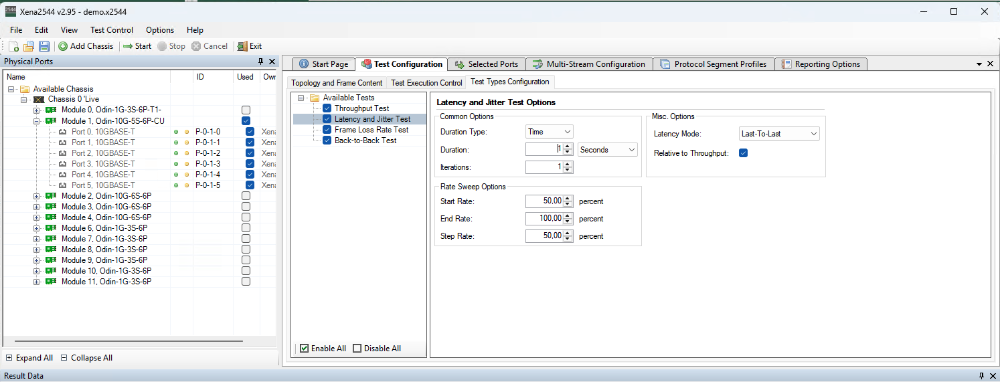
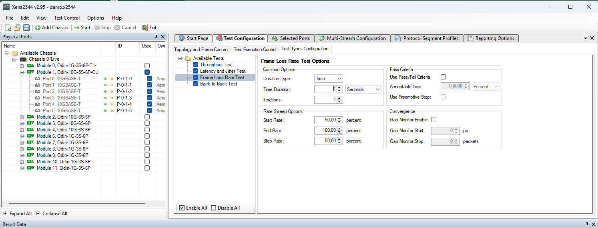
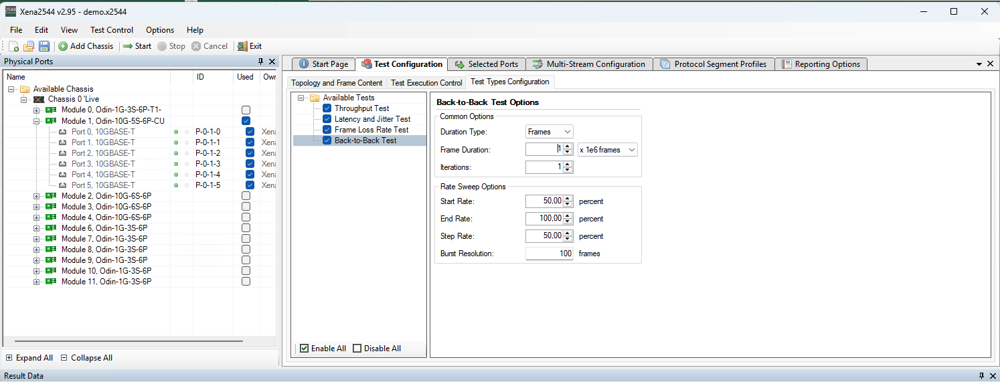
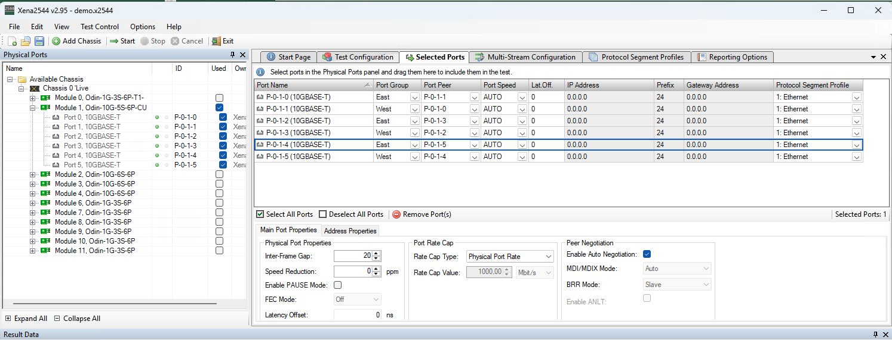
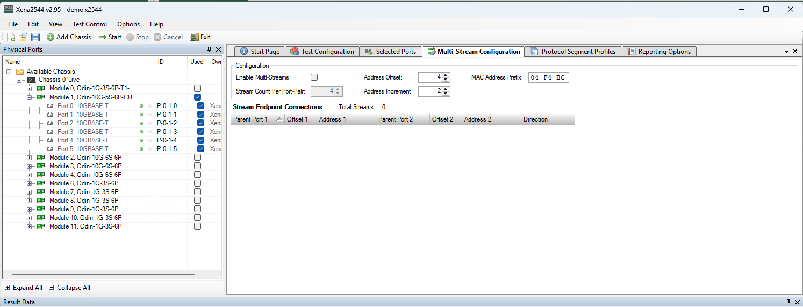
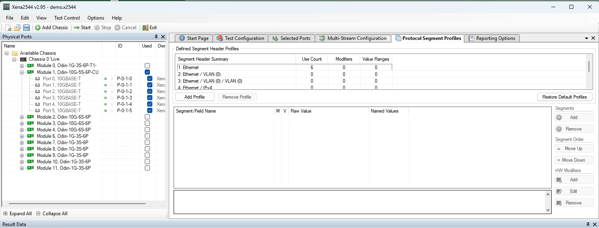

# XOA RFC 2544 Test Example

This example demonstrates how to run RFC 2544 tests using XOA RFC test framework (tdl-xoa-core), and save the result data in csv files.

> Read more about tdl.xoa-core and the rfc test suite plugins at https://docs.xenanetworks.com/projects/tdl-xoa-core

## Requirements

Before you run the test example, first you should install the following software:
* [Python](https://www.python.org/downloads/) 3.11+
* `pip install` [tdl-xoa-driver](https://pypi.org/project/tdl-xoa-driver/)
* `pip install` [tdl-xoa-converter](https://pypi.org/project/tdl-xoa-converter/)
* `pip install` [tdl-xoa-core](https://pypi.org/project/tdl-xoa-core/)

## Run Example

Run the example by writing the following command:

``python run_xoa_rfc.py``

## What the Script Does

```run_xoa_rfc.py``` script does the following:

1. Add tester into framework resource inventory and connect to it
2. Convert the GUI config file (```demo.x2544```) into XOA json config file (```demo.json```) (You can use `RUN_FROM_GUI_CONFIG` to determine if the test run from the Xena2544 GUI config (`True`) or from the converted JSON file (`False`))
3. Run the test configuration file ```demo.json```
4. Subscribe to result
5. Output the final result in JSON format

## GUI Test Configuration
The test configuration from the Xena2544 GUI application:

* Chassis: Xena's public accessible live demo chassis "demo.xenanetworks.com"
* Ports: port 1/0, port 1/1, port 1/2, port 1/3, port 1/4, port 1/5

More configuration details are shown in the screenshots below.









